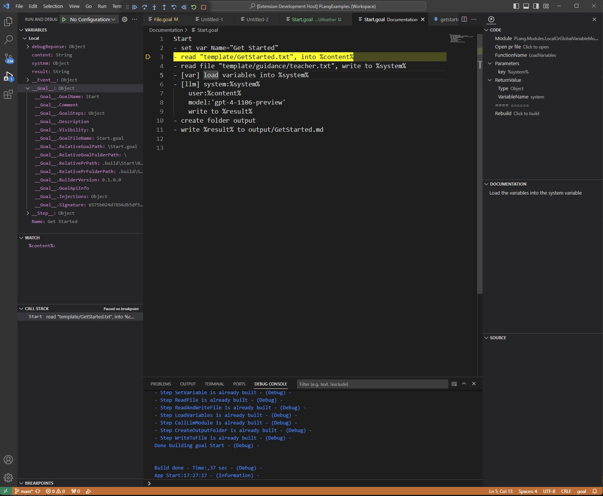

# PLang Extension

## Overview
This extension enhances the development experience in plang by providing an improved overview and debugging capabilities. As this is the initial version, we appreciate your understanding regarding its current quality. Our goal is to eventually transition the entire IDE to be developed in plang.

Get the extension at the [VS Code Marketplace](https://marketplace.visualstudio.com/items?itemName=PlangHQ.plang-extension)

## Features

### Sidebar in .goal Files
When you open a `.goal` file in Visual Studio Code, a dedicated sidebar will be available, offering the following features:

- **Documentation Link:** Quick access to plang documentation.
- **Module Information:** Displays the module used in the current step.
- **.pr File:** Option to view the `.pr` file for deeper insights into the step's operations.
- **Function Details:** Name of the function within the module.
- **Parameter Insights:** Details about parameters sent to the method.
- **Return Values:** Information on the return values, if any.
- **Step Rebuild:** Facility to rebuild the current step.
- **Step Documentation:** Specific documentation related to the step.
- **Generated Source Code:** View the source code for generated C# code, applicable only to CodeModule and ConditionModule.

### Debugging .goal Files

- **Start Debugging:** Press F5 to initiate debug mode.
- **Parameter Input:** VS Code may prompt for parameters; this step is optional.
- **C# Debugging:** Add `--vs` to enable debugging of the C# code. Refer to the debug manual for guidance.

## Visit us
- [Offical website](https://plang.is)
- [On Github](https://github.com/PLangHQ/)
- [Get started](https://github.com/PLangHQ/plang/blob/main/Documentation/GetStarted.md)
